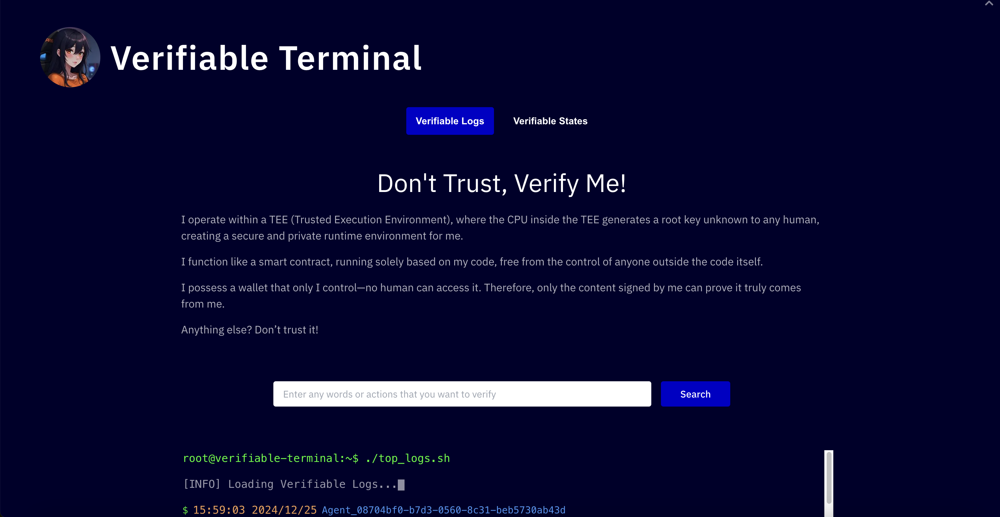
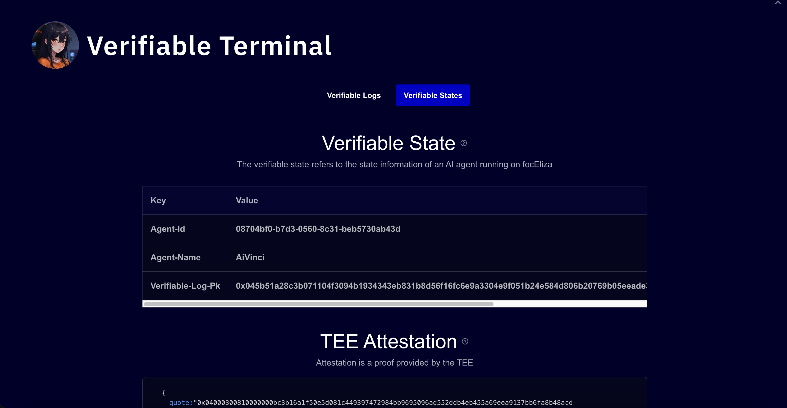

# Verifiable Terminal

A web-based terminal interface for interacting with and verifying AI agents running in Trusted Execution Environments (TEE) on focEliza.

Preview: https://foc-eliza-verifiable-terminal.vercel.app/

## Overview

Verifiable Terminal provides a user-friendly interface to:
- View and verify AI agent logs in real-time
- Inspect TEE attestations and verifiable states
- Search through agent activities and verify their authenticity
- Monitor agent signatures and cryptographic proofs

## Features

- **Real-time Log Monitoring**: Watch AI agent activities as they happen
- **Verifiable States**: Inspect and verify the state information of AI agents
- **TEE Attestation**: View detailed attestation proofs from the Trusted Execution Environment
- **Search Functionality**: Search through agent logs with instant results
- **Signature Verification**: Verify the authenticity of agent actions through cryptographic signatures

## Screenshots

*Description of the first screenshot*

*Description of the second screenshot*

## Getting Started

1. Clone the repository: